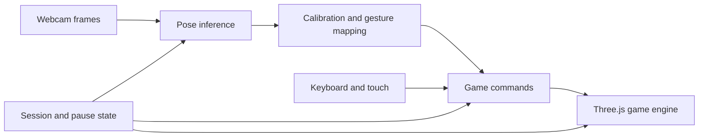

# BODY RUSH — แผนควบคุมด้วยกล้องสำหรับ Sol

วันที่: 2026-09-24

สถานะ: ผู้ใช้สั่งเริ่ม implementation แล้วในบทสนทนาถัดมา; เอกสารนี้ยังเป็นเกณฑ์งานและการตรวจรับ

## ผลการลงมือ 2026-09-24

- P1–P4: ทำแล้วใน `GameEngine3D`, `PoseMapper`, `CameraSession`, worker และ `ThreeGame` รวมการพักเกม กลับคีย์บอร์ด และคืนทรัพยากร
- ผลตรวจรอบก่อนเปลี่ยนท่าล่าสุด: `npm test` ผ่าน 5 tests, `npm run build` ผ่าน, `npm audit --omit=dev` พบ 0 vulnerabilities; ผลเหล่านี้ยังไม่ครอบคลุม mapper แบบยกมือที่เพิ่งปรับ
- P5 browser: เปิด Chrome ผ่าน localhost และเว็บแคมจริงแล้ว โมเดล/worker โหลด ตรวจท่ากลางจนเริ่มเกมได้ พักเมื่อจับตัวหาย และสลับกลับคีย์บอร์ดแล้ว `video.srcObject` เป็น `null`
- ผู้ใช้แจ้งว่ากล้องตั้งไว้ไกล จึงเปลี่ยนจากกระโดดจริงเป็นยกมือข้างเดียวแล้วลดมือลง: ที่หน้าเมนูใช้เริ่มเกม และระหว่างเล่นใช้สั่งกระโดด
- ปรับ `PoseMapper` ให้ตั้งท่าจากช่วงไหล่ถึงเอวและมือ ไม่ต้องเห็นข้อเท้า; `ThreeGame` แสดงกรอบช่วงตัว, hint ตามผลตรวจ, ปุ่ม `ดูวิธีเล่น` พร้อมภาพยกมือเคลื่อนไหว และพักเกมเมื่อไม่เห็นมือที่จำเป็นต่อเนื่อง 300 ms
- `npm run build` ผ่านหลังการเปลี่ยนเป็นยกมือรอบล่าสุด; ยังไม่ได้รัน `npm test` หรือยืนยัน gesture กับเว็บแคมจริง ต้องให้ผู้เล่นลองยกมือและลดมือหลายรอบ รวมถึงวัด FPS/latency บนเครื่องเป้าหมาย

## 1. เป้าหมายและสิ่งที่ยืนยันแล้ว

- เพิ่มการเล่นผ่านเว็บแคมด้วย Google MediaPipe Tasks Vision
- ขยับลำตัวซ้าย–ขวาเพื่อเลือกเลน และยกมือข้างเดียวแล้วลดมือลงเพื่อเริ่มเกมหรือสั่งกระโดด (เปลี่ยนตามคำขอล่าสุดของผู้ใช้)
- เป้าหมายรุ่นแรก: คอมพิวเตอร์/โน้ตบุ๊ก ใช้ Chrome พร้อมเว็บแคม ผู้เล่นหนึ่งคน
- รอบวางแผนก่อนหน้าเปลี่ยนเฉพาะเอกสาร; งาน implementation เริ่มเมื่อผู้ใช้บอก "ลุยเลย sol คุง"
- เชื่อมกับเกม Three.js ที่หน้าเว็บเรียกใช้อยู่

ขอบเขตที่ใช้ทำรุ่นแรก: เปิดกล้องจากเมนู, ตั้งท่ากลางก่อนเริ่ม, พักเมื่อจับตัวไม่ได้หรือซ่อนแท็บ, กดเล่นต่อเมื่อพร้อม, มีคีย์บอร์ดเป็นทางเลือก และประมวลผลภาพในเครื่องโดยไม่บันทึกหรือส่งวิดีโอ ผู้ใช้ไม่ได้ตอบคำถามยืนยันขอบเขตนี้แยกต่างหาก แต่ได้สั่งให้เริ่มทำ; จึงใช้ข้อเสนอในแผนเป็นค่าเริ่มต้น

รายละเอียดทางเทคนิคและค่าตัวเลขด้านล่างเป็นข้อเสนอสำหรับพัฒนาและวัดผล ไม่ใช่ผลทดลองที่ผ่านแล้ว

## 2. ผลตรวจ setup-matt-pocock-skills

การตั้งค่ามีอยู่ครบแล้วใน `AGENTS.md` และ `docs/agents/`:

| ส่วน | การตั้งค่าปัจจุบัน |
| --- | --- |
| Issue tracker | GitLab Issues ผ่าน `glab` |
| Triage | needs-triage, needs-info, ready-for-agent, ready-for-human, wontfix |
| Domain docs | single-context: `CONTEXT.md` และ `docs/adr/` |

ไม่มี `CLAUDE.md`; มีสกิว triage; ไม่พบ monorepo configuration จากโครงสร้างและ package.json ที่ตรวจ การตั้งค่าเดิมเพียงพอสำหรับอ่านเอกสารและวางแผน จึงไม่มีการเขียน setup ซ้ำ

ข้อจำกัด: `git remote -v` ว่าง ทำให้ยังระบุ GitLab project สำหรับเผยแพร่ spec/issues ไม่ได้ เอกสารนี้เป็นแผนใน repo ไม่ใช่การเปลี่ยน issue tracker เป็น local markdown และยังไม่ได้สร้าง GitLab issue หรือ labels บนเซิร์ฟเวอร์

สกิว `to-spec`, `to-tickets`, `triage` และ `implement` จะอ้างอิง configuration เหล่านี้ต่อไป แก้ `docs/agents/*.md` ได้โดยตรงเมื่อผู้ใช้ต้องการเปลี่ยน convention

เส้นทางตาม ask-matt: setup audit → grill-with-docs → แผนนี้ → ผู้ใช้อนุมัติให้เริ่ม → Sol ทำงานตามลำดับด้านล่าง หากต้องเผยแพร่ spec/tickets ให้ระบุ GitLab project ก่อน

## 3. จุดเชื่อมกับโค้ดปัจจุบัน

ตรวจจาก source ณ วันวางแผน ให้ Sol ตรวจตำแหน่งอีกครั้งก่อนแก้:

- `src/App.tsx` เรียก `ThreeGame`; Phaser scenes ไม่ใช่เส้นทางที่ใช้งานในหน้านี้
- `src/game/three/ThreeGame.tsx` เป็นเจ้าของ engine, render loop, HUD และเมนู ปัจจุบันมี MENU / RUNNING / GAMEOVER
- `src/game/three/GameEngine3D.ts` มี public `moveLane(dir)` และ `jump()` แต่ยังไม่มี pause/resume contract
- `moveLane` เป็นการเลื่อนแบบสัมพัทธ์ การเรียกทุกเฟรมจากท่าค้างจะทำให้เลื่อนไปสุดขอบ ต้องเพิ่มคำสั่งเลือกเลนแบบระบุตำแหน่ง
- `jump()` กันกระโดดซ้ำเฉพาะตอนลอยอยู่ ตัวแปลท่าต้องแยกช่วงลอยและลงพื้น เพื่อไม่สั่งซ้ำเมื่อยังค้างเหนือระดับอ้างอิง
- Collision ใช้ logical lane ขณะที่ภาพตัวละครค่อย ๆ เคลื่อนเข้าหาเป้าหมาย ให้รักษากติกานี้ในงานเพิ่ม input และบันทึกข้อสังเกตแยกหากพบปัญหาจากการเล่นจริง
- เกมมีตัวจับเวลาแบบ `setTimeout` เช่น cola speed boost ซึ่งยังเดินระหว่าง pause ต้องย้ายเวลาที่มีผลต่อ gameplay มาใช้เวลา simulation
- `destroy()` ยังไม่ได้ถอด touch listeners; มี React StrictMode จึงต้องรองรับการเริ่ม/ล้าง session ซ้ำและผล async ที่กลับมาช้า
- `package.json` ยังไม่มี MediaPipe หรือ test runner ต้องจัดงานเพิ่ม dependency และชุดทดสอบที่จำเป็นไว้ชัดเจน

## 4. ประสบการณ์ผู้เล่นที่เสนอ

1. เลือกอาหารเช้าและวิธีควบคุมจากเมนู: คีย์บอร์ด/สัมผัส หรือกล้อง
2. กดเปิดกล้อง จึงเริ่มขอ permission และโหลดโมเดล แสดงสถานะโหลด/รอ permission พร้อมปุ่มยกเลิก
3. แสดงภาพตัวเองแบบกระจกพร้อมกรอบช่วงไหล่ถึงเอวและมือทั้งสองข้าง มี hint ภาษาไทยชัดเจนว่าต้องอยู่ตรงไหน และปุ่ม `ดูวิธีเล่น` แสดงท่ากลาง ซ้าย–ขวา และยกมือตัวอย่าง
4. ยืนตรงนิ่งในท่ากลาง เก็บตัวอย่างต่อเนื่องประมาณ 1.5 วินาที แล้วทดลองซ้าย กลาง ขวา และยกมือในหน้าตั้งค่า
5. เริ่มเกมเมื่อกล้องพร้อมและตั้งท่ากลางสำเร็จ มี countdown สั้น ๆ ก่อนวิ่ง
6. ระหว่างเล่นแสดงสถานะจับท่าทางและภาพกล้องขนาดเล็กที่ไม่บังทางวิ่ง ข้อความผู้เล่นเป็นภาษาไทย
7. หากตำแหน่งลำตัวหายหรือผลตรวจเก่าเกินช่วงยอมรับ ให้พักรอบเล่น แสดงสาเหตุและปุ่มเล่นต่อ/ตั้งท่ากลางใหม่/เปลี่ยนเป็นคีย์บอร์ด/กลับเมนู
8. กลับมาจับตัวได้แล้วต้องเห็นท่ากลางและกดเล่นต่อก่อน countdown; ไม่กลับมาวิ่งเองทันที
9. จบเกม กลับเมนู ปิดโหมดกล้อง หรือออกจากหน้า ให้คืนทรัพยากรกล้องทั้งหมด การเปิดใหม่ต้องเริ่ม session ใหม่

## 5. การแปลท่าทางเป็นคำสั่ง

### เลือกเลน

- ใช้จุดกึ่งกลางไหล่เป็นตำแหน่งลำตัว เทียบกับค่าท่ากลาง และปรับระยะด้วยความกว้างไหล่ที่บันทึกตอนตั้งค่า
- นิยามซ้าย–ขวาตามที่ผู้เล่นเห็นในภาพกระจก: ผู้เล่นขยับไปด้านซ้ายของหน้าจอ ตัวละครต้องไปเลนซ้าย แปลงพิกัดเพียงครั้งเดียว
- ส่งเป้าหมายเลนซ้าย/กลาง/ขวาแบบ absolute; อยู่ในท่าเดิมต้องคงเลนเดิมและไม่ส่งเสียงเลี้ยวซ้ำ
- ใช้ smoothing ตามเวลา, เขตกลาง, threshold เข้า/ออกต่างกัน (hysteresis) และช่วงยืนยันท่าสั้น ๆ เพื่อกันสั่นตามขอบเลน
- ค่าเริ่มต้นเพื่อทดลอง: ระยะเข้าเลนข้าง 0.6 เท่าความกว้างไหล่, กลับกลางเมื่อเหลือ 0.35 เท่า, ยืนยันประมาณ 100 ms ค่าทั้งหมดต้องปรับจากการทดลองจริง
- ใน camera mode กล้องเป็นผู้เลือกเลน; คีย์บอร์ดเปิด pause/เปลี่ยนโหมดได้ แต่ไม่ควรแย่งเลนกับกล้อง ผู้เล่นเลือก manual mode อย่างชัดเจนเพื่อใช้ปุ่มควบคุมวิ่ง

### เริ่มเกมและกระโดดด้วยมือ

- ตั้งท่ากลางโดยเห็นไหล่ สะโพก และมือ; ไม่ต้องเห็นข้อเท้าหรือทั้งตัว เพื่อรองรับกล้องที่อยู่ไกล
- ยกข้อมือข้างใดข้างหนึ่งให้สูงกว่าระดับไหล่ค้างสั้น ๆ เพื่อส่งคำสั่งหนึ่งครั้ง; ลดมือลงก่อนยกครั้งถัดไปเพื่อ rearm
- ในหน้าเมนู คำสั่งยกมือเริ่มเกม; ระหว่างเล่นส่งคำสั่งเดียวกันเป็น jump
- หากไม่เห็นมือที่จำเป็น ให้งดคำสั่งและแสดง hint; พักเกมเมื่อการติดตามมือหายต่อเนื่องประมาณ 300 ms

### ความน่าเชื่อถือและการตั้งค่าซ้ำ

- ใช้ confidence/visibility ของ landmark ที่แต่ละคำสั่งจำเป็นต้องใช้ ตัวอย่างค่าเริ่มต้น 0.6 ต้องปรับจากการวัด
- ข้อมูลไม่ถูกต้องไม่สร้างคำสั่งใหม่; ช่วงหายชั่วคราวคงเลนเดิมโดยไม่ส่งคำสั่งจากมือ
- เสนอเกณฑ์พักเมื่อไม่มีผลลำตัวที่เชื่อถือได้ต่อเนื่อง 300 ms รวมกรณีกล้องหยุดส่งเฟรม ตรวจด้วยตัวจับเวลาของแอป ไม่รอผล inference ถัดไป
- กลับจาก pause, เปลี่ยนกล้อง, เริ่มรอบใหม่ หรือ re-center ให้ล้างประวัติ smoothing/gesture และผลที่ค้างอยู่; หลังพักต้องลดมือลงก่อนยอมรับ gesture ใหม่
- โมเดลตั้งให้ตรวจหนึ่งคน ไม่ถือว่านี่เป็นการยืนยันตัวตนหรือการรับประกันว่าไม่มีบุคคลอื่นในภาพ

## 6. โครงสร้างที่เสนอ

- **Camera session**: ดูแล stream, video, permission, model/worker, scheduling และ start/stop แบบเรียกซ้ำได้ ใช้หมายเลข session กันผลเก่ากลับมาสั่งงานใหม่
- **Pose mapping**: รับ landmarks กับเวลา แล้วให้ target lane/jump/tracking status ทดสอบได้โดยไม่ต้องมีกล้องหรือ WebGL
- **Game commands**: API ขนาดเล็กสำหรับเลือกเลน กระโดด และ pause/resume โดย engine เป็นผู้บังคับข้อจำกัดสถานะทั้งหมด ไม่จำลอง keyboard events
- **React integration**: ดูแลเมนู การตั้งท่ากลาง สถานะ session และปุ่ม recovery แยกจาก engine; ไม่ส่ง landmarks ทุกเฟรมผ่าน React state
- ใช้แหล่งตัดสินใจ session เพียงแห่งเดียว แยกสถานะกล้อง OFF / REQUESTING / LOADING / CALIBRATING / READY / TRACKING_LOST / ERROR ออกจากสถานะเกม MENU / RUNNING / PAUSED / GAMEOVER
- Pause ต้องหยุดคะแนน ระยะทาง การชน พลังงาน การเกิดสิ่งกีดขวาง และเวลาของเอฟเฟกต์ gameplay พร้อมจัดการเสียง; resume ไม่สะสม delta ของช่วงที่พัก
- การซ่อนแท็บให้พักทันทีและหยุด inference การกลับมาไม่ใช่คำสั่ง resume

## 7. MediaPipe และประสิทธิภาพ

ข้อเท็จจริงจากเอกสาร Google: Web ใช้ `@mediapipe/tasks-vision` กับ Pose Landmarker; `VIDEO` ใช้ประมวลผลเฟรมกล้อง และ `detectForVideo` ทำงาน synchronous ซึ่งอาจบล็อก main thread เอกสารแนะนำ worker สำหรับแยกงานนี้ [1] API รับ timestamp ของเฟรมเป็น ms [3]

ข้อเสนอสำหรับ implementation:

- เริ่มประเมิน Pose Landmarker Lite, `numPoses: 1`, ปิด segmentation; ยืนยันคุณภาพท่าทางจริงก่อนเลือก Lite หรือ Full [2]
- Pin เวอร์ชัน npm และ WASM ให้ตรงกัน พร้อมระบุ model asset ที่แน่นอนและ provenance; ใช้ assets ที่เสิร์ฟจากแอปเมื่อจัดแพ็กเกจจริง ไม่มี URL แบบ `latest` ใน production
- ทำ probe หลังได้รับอนุมัติให้โค้ด เพื่อยืนยันว่า worker + backend + frame transport ทำงานร่วมกับ Vite และ Chrome เป้าหมาย ก่อนขยาย UI
- ส่งเฟรมใหม่เท่านั้น ใช้ timestamp เพิ่มขึ้นต่อเนื่องใน session; มี inference ค้างได้หนึ่งงาน ทิ้งเฟรมเก่าแทนสะสมคิว และคืนทรัพยากรภาพที่ถ่ายโอน
- วัด CPU/GPU delegate ร่วมกับ Three.js จริง เลือกทางที่ให้ผลเหมาะกับเครื่องเป้าหมาย หาก worker/backend ใช้ไม่ได้ ให้รายงานผลและพิจารณา main-thread แบบจำกัดอัตราเฉพาะเมื่อผ่านเกณฑ์ความลื่น
- เป้าเริ่มต้นที่ต้องวัด: inference ประมาณ 15–20 Hz, render เฉลี่ยอย่างน้อย 50 FPS และความหน่วงจากท่าทางถึงการตอบสนอง p95 ไม่เกิน 200 ms บนเครื่องทดสอบที่ระบุรุ่น ช่วงเวลายืนยันท่านับอยู่ในความหน่วงนี้
- ตัวเลขเหล่านี้เป็นงบประมาณเพื่อประเมิน ไม่ใช่การรับรองทุกเครื่อง รายงาน baseline เกมเดิมเทียบเปิดกล้อง และปรับ scope/ค่าตั้งถ้าไม่ผ่าน

## 8. Permission, error และ cleanup

กล้องต้องใช้ secure context และ browser permission; localhost ใช้พัฒนาได้ `getUserMedia` อาจรอไม่สิ้นสุดหากผู้ใช้ยังไม่เลือก [4]

- ขอเฉพาะ video ปิด audio; ขอสิทธิ์เมื่อผู้เล่นกดเปิดกล้อง
- แยกข้อความกล้องไม่พบ / permission ถูกปฏิเสธ / กล้องถูกใช้งาน / เว็บไม่รองรับ / model หรือ WASM โหลดล้มเหลว พร้อม retry และ manual mode
- Cancel ต้องทำได้แม้ permission หรือโมเดลยังรออยู่ หาก stream/model กลับมาหลัง cancel ให้คืนทรัพยากรทันที
- กล้องถูกถอดหรือ track จบระหว่างเล่นต้องพักพร้อมแจ้งสาเหตุ ไม่ปล่อยรอบเล่นต่อด้วย input เก่า
- ปิด session: cancel frame callbacks, stop ทุก media track, ล้าง video source, ปิด task resources, terminate worker, ถอด listeners และยกเลิก timers ของ session
- ประมวลผล landmarks ในเครื่อง ภาพใช้เฉพาะ preview/inference; ไม่บันทึกวิดีโอหรือส่งภาพ/landmarks ไปเซิร์ฟเวอร์ การโหลด package/model เป็น network request ที่ต้องแยกจากการส่งภาพ

## 9. ลำดับงานสำหรับ Sol

รายการนี้เป็น work breakdown ในแผน ไม่ใช่ issues ที่เผยแพร่; ผู้ใช้สั่งเริ่ม implementation แล้ว และสถานะล่าสุดสรุปไว้ต้นเอกสาร

| งาน | ขึ้นกับ | สิ่งที่ส่งมอบและเกณฑ์จบ |
| --- | --- | --- |
| P0 ยืนยันขอบเขต | ผู้ใช้ | ผู้ใช้ยืนยันท่าทางและ Chrome แล้ว สั่งเริ่ม implementation; recovery/privacy ใช้ข้อเสนอเริ่มต้น |
| P1 Input และ pause | P0 | เลือกเลนแบบ absolute, jump, pause/resume ผ่าน contract เดียว; manual controls ยังเล่นได้; pause ไม่กินสถานะหรือเวลา boost; tests ครอบคลุมพฤติกรรมนี้ |
| P2 Camera/model probe | P0 | เปิด/ปิดกล้องและเห็น landmarks บน Chrome; เลือก pinned package/assets และ backend จากผลวัดร่วมกับ renderer; cancel/late result/cleanup ทำงาน |
| P3 เล่นครบผ่านกล้อง | P1, P2 | ตั้งท่ากลาง → เลือกสามเลน → ใช้ยกมือตอนเมนูเริ่มเกมและระหว่างเล่นกระโดด; ผู้เล่นใช้ท่าค้างแล้วไม่เกิดคำสั่งซ้ำ |
| P4 Recovery และเมนู | P3 | tracking loss/tab hidden/กล้องหลุดพักจริง; manual fallback; resume/recalibrate/menu/game-over/restart ไม่เหลือ session เก่า; UI ภาษาไทย |
| P5 ตรวจรับ | P4 | automated behavior tests + build ผ่าน; เล่นด้วยกล้องจริงและวัด performance ตาม checklist พร้อมรายงานสิ่งที่ยังไม่ผ่าน |

P1/P2 แยกแนวคิดได้ แต่ Sol ทำตามลำดับได้โดยไม่จำเป็นต้องใช้หลาย agent เริ่มด้วย slice ที่เล่นได้ก่อนเพิ่มตัวเลือกอื่น

## 10. แผนทดสอบและเกณฑ์ตรวจรับ

เพิ่มชุดทดสอบขนาดเล็กที่เหมาะกับ Vite/TypeScript เช่น Vitest หลังเริ่ม implementation เนื่องจาก repo ยังไม่มี runner

Automated tests เน้นพฤติกรรม:

- ลำดับท่ากลาง/ซ้ายค้าง/กลาง/ขวาค้างให้เลนถูกต้อง ไม่สั่นเมื่อ landmark มี noise ใกล้ threshold และ mirror ถูกทิศ
- ยกมือค้างให้หนึ่งคำสั่ง; มือต้องลดลงก่อนยกซ้ำ; ตั้งท่าและเลือกเลนได้โดยไม่เห็นเท้า
- confidence ต่ำ, timestamp เก่า, ผลสลับลำดับ, เฟรมหยุด และผลจาก session เก่าไม่ทำให้ตัวละครเคลื่อน
- pause คงคะแนน ระยะทาง พลังงาน entity positions และเวลาที่เหลือของ boost; resume ไม่ทำให้เกมกระโดดข้ามเวลา
- cancel ขณะรอ permission/model, mount/unmount ซ้ำ, restart, กลับเมนู และ game-over คืนทรัพยากรครบ
- ทดสอบบนขอบเขต session-to-command และ engine state ที่สังเกตได้; ใช้ stream/clock/model จำลองเฉพาะ external boundary ไม่ทำ snapshot โครงสร้าง Three.js ทั้งฉาก

ตรวจด้วยกล้องจริงบน Chrome:

- เริ่ม fresh load จนเล่นได้; ขยับซ้าย–กลาง–ขวาซ้ำ, ยกมือตอนเมนูเพื่อเริ่มเกม, ยก–ลดมือสองรอบเพื่อกระโดด, เก็บดาวสูงและข้ามสิ่งกีดขวาง
- ท่าต่างกันตามความสูงและระยะจากกล้อง, แสงห้องทั่วไป, มือหลุดกรอบ, เดินออกนอกภาพและกลับมา
- ปฏิเสธ permission, ไม่ตอบ permission แล้ว cancel, เปิดใหม่, โหลด asset ไม่สำเร็จ, ถอดกล้อง, สลับแท็บ, เปลี่ยนโหมด, game-over และ retry
- ยืนยันไม่มีการส่งเฟรม/landmarks ออกทาง network และ camera indicator ดับหลังปิด session
- บันทึกเครื่อง/OS/Chrome, backend/model/resolution, FPS ก่อน/หลัง, inference time และ input latency พร้อมวิธีวัด; ชุด landmarks จำลองไม่ใช้แทนการลองกล้องจริง
- รัน behavior tests และ `npm run build`; รายงาน automated pass แยกจาก hardware/browser checks ที่ยังไม่ได้ทำ

## 11. ขอบเขตที่เลื่อนไปรุ่นถัดไป

มือถือ/Safari, ผู้เล่นหลายคน, การควบคุมด้วยมืออย่างเดียว, สั่งทุกเมนูด้วยท่าทาง, ฝึกโมเดลเอง, บันทึกวิดีโอ, cloud inference และการย้าย engine เกม

## 12. ข้อความเริ่มงานให้ Sol หลังอนุมัติแผน

> อ่าน AGENTS.md, docs/agents/domain.md, CONTEXT.md และ docs/plans/mediapipe-camera-controls.md ก่อนลงมือ ตรวจข้อเสนอที่ยังไม่ยืนยันกับคำตอบล่าสุดของผู้ใช้ จากนั้นทำ P1–P5 ตาม dependencies โดยใช้ ThreeGame/GameEngine3D เป็นเป้าหมาย รักษางานเดิมที่ยังไม่ commit และทดสอบทั้งคำสั่งเกมกับ lifecycle กล้อง รายงานผลกล้องจริงแยกจาก automated tests งานก่อนหน้านี้เป็นการวางแผนเท่านั้น เริ่ม implementation ได้เมื่อผู้ใช้สั่งเริ่มอย่างชัดเจน

## แหล่งอ้างอิง

ตรวจเมื่อ 2026-09-24; ข้อเสนอ UX, thresholds และโครงสร้างด้านบนเป็นการออกแบบของโปรเจกต์

1. [Google: Pose Landmarker for Web](https://ai.google.dev/edge/mediapipe/solutions/vision/pose_landmarker/web_js) — package, VIDEO mode และ synchronous inference/worker
2. [Google: Pose Landmarker overview](https://ai.google.dev/edge/mediapipe/solutions/vision/pose_landmarker) — model variants และตำแหน่ง landmarks
3. [Google: PoseLandmarker JavaScript API](https://ai.google.dev/edge/api/mediapipe/js/tasks-vision.poselandmarker) — detectForVideo และ timestamp
4. [MDN: getUserMedia](https://developer.mozilla.org/en-US/docs/Web/API/MediaDevices/getUserMedia) — secure context, permission และ error cases
